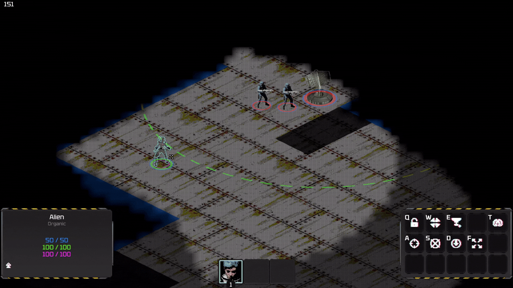
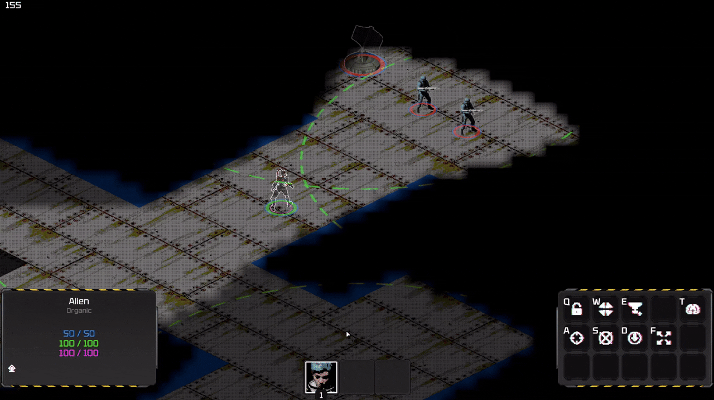
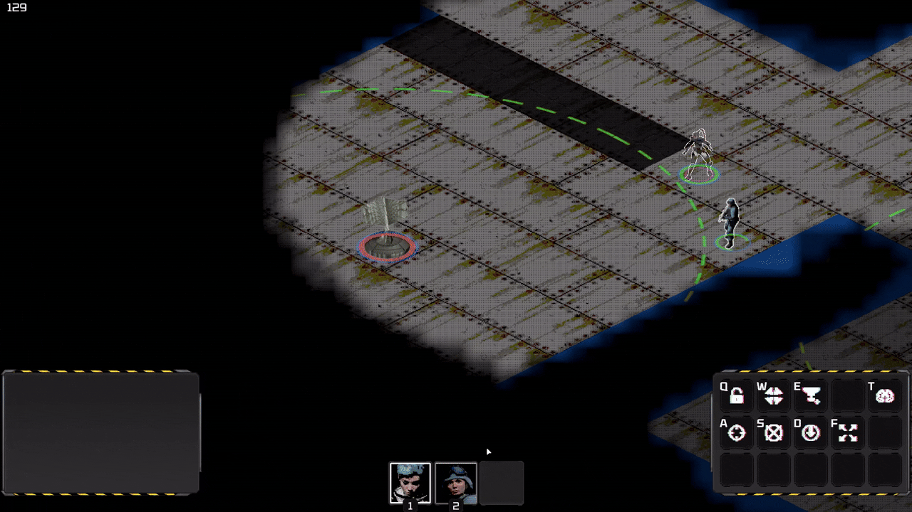
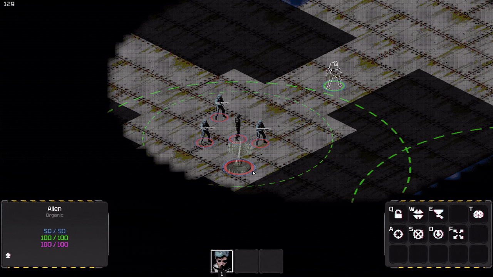
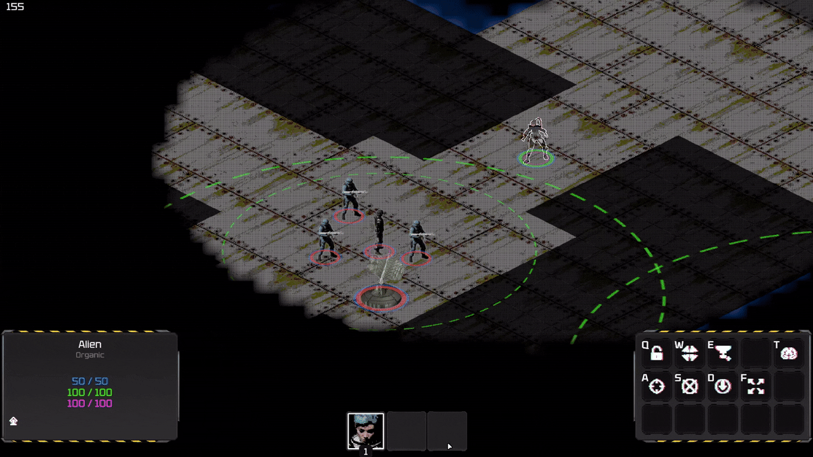

# Zeratul/Assimilate (Prototype)

## Overview
Zeratul is a prototype of a Stealth Real Time Tactics, revolving around creative ability usage and thoughtful unit management.

### Avoid detection
Detectors are your biggest enemy, they reveal you to the enemies allowing them to attack you

### Take control of enemies
Enemy causes you too many problems, turn them against their own allies.

### Plan your moves
Hit pause and take your time to observe the situation and issue orders to your units

### Find creative solutions
There is never a single right solution to any obstacle, use everything you have to deal with it.

## Structure
