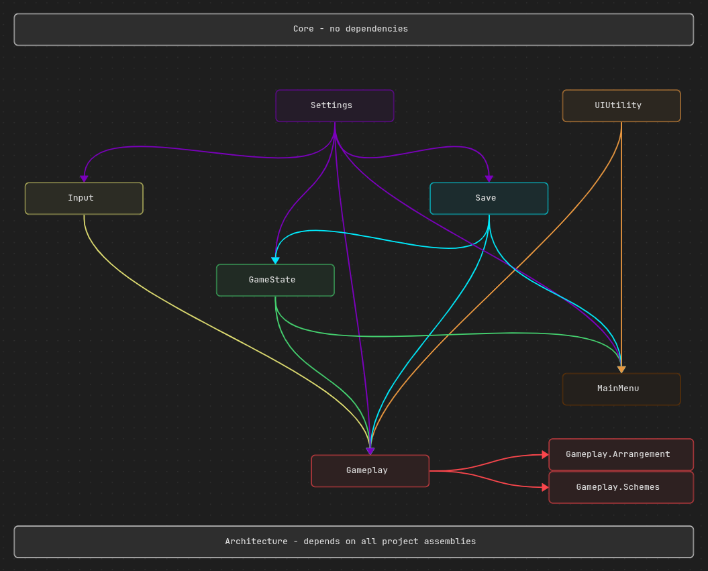
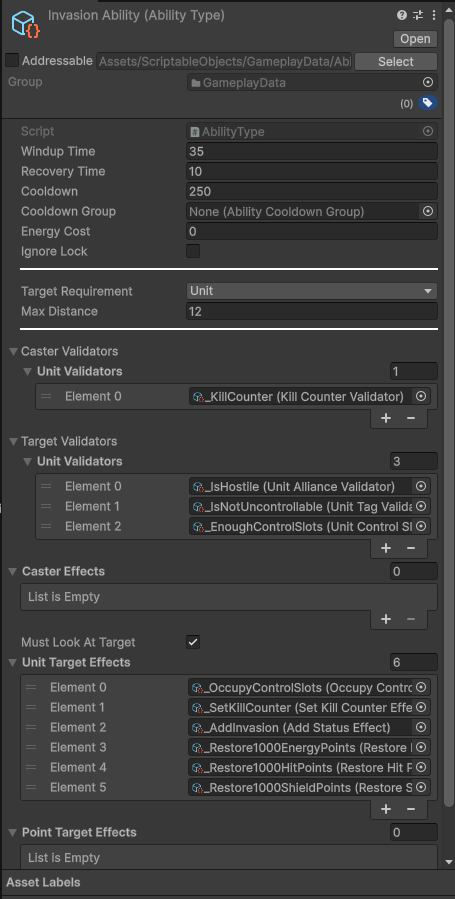
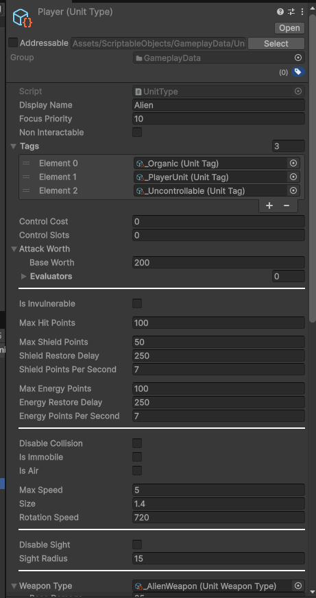

# Zeratul/Assimilate

## Table of content
- [Overview](#overview)
- [Core gameplay](#core-gameplay)
  - [Cloak and detection](#cloak-and-detection)
  - [Invasion](#invasion)
  - [Tactical pause](#tactical-pause)
  - [Player agency](#player-agency)
- [Implementation](#implementation)
  - [Software](#software)
  - [Technologies](#technologies)
  - [Project structure](#project-structure)
  - [Technical highlights](#technical-highlights)
    - [State Machine](#state-machine)
    - [Saving](#saving)
    - [Unit management](#unit-management)
    - [Modular gameplay data](#modular-gameplay-data)

## Overview
Zeratul (temporary name) is a stealth real-time tactics, revolving around creative ability usage and thoughtful unit management. The game is currently in MVP state. The game is planned as a linear pack of missions, connected by a single story. However in each of the missions in particular, player is given a freedom of choosing their own way of completing the mission or particular objectives. This is achieved by implementing multiple interconnected gameplay systems, such as cloak/detection, mind control and vision.

## Core gameplay

### Cloak and detection
Player is **permanently cloaked**, which means that they cannot be directly seen by enemies or targeted by enemy attacks and abilities. Certain effect may **detect** hostile units for allies, negating all benefits of the cloak. For example Sensor Towers passively detects all hostile units in the area of effect around it.

### Invasion
Another core ability player has is Invasion. This ability lets player to take control of any enemy unit at a certain cost, depending on target unit itself. This can be used to use valuable enemy abilities or strong enemy units against their allies.

### Tactical pause
Player can toggle pause anytime to observe the situation, plan their moves and issue orders to their units. Thus, the game does not require high APM or execution quality.

### Player agency
The game present multiple closely connected gameplay systems that let player choose their on way of solving certain combat puzzle

## Implementation

### Software
- **Engine:** Unity 6000.5.0f1
- **IDE:** JetBrains Rider 2026.1.3
- **3D art and rendering:** Blender 5.0.1
- **2D art:** Affinity

### Technologies
- **Addressables**. All scenarios (levels) are packed into bundles and loaded into memory whenever player launches them.
- **Zenject**. DI Architexture.
- **UniTask**. Async and threading optimizaion.
- **UniRX**. Mostly used in view logic.

### Project structure
- **[Core](Assets/Scripts/_Core).** Project-wide data structures and extension methods.
- **[Architecture](Assets/Scripts/Architecture).** DI.
- **[Gameplay](Assets/Scripts/Gameplay).** Core gameplay logic.
  - **[Arrangement](Assets/Scripts/Gameplay/Arrangement).** Gameplay scene setup, saving and loading.
  - **[Schemes](Assets/Scripts/Gameplay/Schemes).** Trigger system for mission-specific objectives and scripts.
- **[GameState](Assets/Scripts/GameState).** State Machine and scene management.
- **[Input](Assets/Scripts/Input).** InputSystem actions.
- **[MainMenu](Assets/Scripts/MainMenu).** Main menu UI
- **[Save](Assets/Scripts/Save).** Savefile data structures and I/O logic
- **[Settings](Assets/Scripts/Settings).** Settings config structure, Settings menu UI elements
- **[UIUtility](Assets/Scripts/UIUtility).** Framework for creating windows and menus.

**Dependencies graph:**

### Technical Highlights

#### State Machine
Zeratul uses classic State Machine pattern to organize game flow and scene management.
There are two major classes maintaining control over game state:
- [GameStateMachine](Assets/Scripts/GameState/GameStateMachine.cs). Contains all possible state. Responsible for transition logic itself.
- [GameFlowController](Assets/Scripts/GameState/GameFlowController.cs). Implements specific state transition cases. For example, launching clean scenario, loading saved game or quitting to main menu.

Currently project only has three states:
- **Boot.** The initial state the game starts in. Launches bootstrap processes such as loading settings config and searching savefiles in save directory. After this the game transits to Main Menu state
- **Main Menu.** General state from which player may launch scenario or load a savefile to transit to Gameplay state.
- **Gameplay.** This state can be transited with payload ([SaveData](Assets/Scripts/Save/Data/SaveData.cs)). If there is no payload, the game will start a clean scenario. If there is a payload, the game state will be reconstructed from SaveData.

Such structure ensures clean game state flow and is easily expandable by adding new states when needed. This may include metagame screens (loadout and upgrades) or introductory briefings for each mission.

#### Saving system

Player can manually save the game anytime using pause menu or F5 hotkey (quick save). Thus, each of the gameplay objects must have a clean serialization deserialization process. This is achieved by dividing whole gameplay data into systems. Each of the saving systems has it's own data structure and save/load logic.

Savefile is serialized from [SaveData](Assets/Scripts/Save/Data/SaveData.cs) class, assembled from multiple data structures implementing [ISaveSystem](Assets/Scripts/Save/Data/ISaveSystem.cs) interface.
Each of the save systems has it's runtime counterpart inheriting [SavingSystem<ISaveSystem>](Assets/Scripts/Gameplay/Arrangement/Saving/SavingSystem.cs), constructing data of a system and reproducing game state from this data if scenario was launched from a savefile.

For example [UnitsSaveData](Assets/Scripts/Save/Data/UnitsSaveSystem.cs) contains data about all units on the map, their type, position, owner and other mutable data.
- **Saving.** Whenever player saves the game, the systems requests collection of all units from [UnitPool](Assets/Scripts/Gameplay/Units/UnitPool.cs) and requests [UnitSaveData](Assets/Scripts/Save/Data/Units/UnitSaveData.cs) from each of them.
- **Loading.** By default, on scenario initialization, units are spawned from UnitSpawnPoint contained in scenario prefab. If scenario was launched from savefile, units are spawned using UnitSaveData from UnitsSaveSystem instead.

Benefits of this system:
- **Easily expandable.** Whenever a new gameplay feature, that requires saving is added, developer can quickly add a new saving system and strap it to existing pipeline.
- **Cross-platform.** Newtonsoft.JSON serialization and saving logic does not rely on platform-specific features. The only thing left is platform specific I/O workflow.

Known issues:
- **Older version support.** Savefiles made on older versions may not include some systems and cannot be loaded. This is acceptable because player does not need to save the whole campaign, savefile corruption only discards a single mission progress, not the whole game. Still it can be fixed by using default blank systems instead of missing ones.
- **Safety.** Currently all data is saved raw in .json file, though in the future it is planned to encrypt them with AES.

#### Unit management
Zeratul uses standard RTS controls, known to anyone, who have played any RTS game. Except controls are adapted to low units count. Most of the time player has up to three units under control at the same time.
Players can:
- Select friendly units with left click.
- Select multiple friendly units with selection box.
- Use shift to select or deselect units individually
- Select single enemy unit to view their stats, statuses and available orders (abilities).
- Use digit keys 1-9 to select friendly untis
- Issue orders to selected units using command panel or hotkeys.
- Issue smart order with right click. Right clicking an enemy is an attack order, while right clicking a point is a move order.
- Use shift to queue orders.

#### Modular gameplay data
Whole gameplay data (Unit types, Order types, Abilities, Effects) is contained in ScriptableObjects
 
This allows game designer to use simply iterate content and prototype new enemies or player abilities.

One of the most important data structures is [UnitValidator](Assets/Scripts/Gameplay/Data/Validator/UnitValidator.cs). This is an abstract class, used a filter method for units all over the gameplay logic.
Various validators filter units by their type, hostility, flags, health or other resources, status effects, etc.
Validators use cases:
- **Abilities**. If ability requires a unit as a target, Target Validators define which units can be targeted by this ability.
- **AI**. Enemy AI uses validators to evaluate targets priority by their properties.
- **Mission scripts (Schemes) behavior**. Mission may have unique optional objectives such as "Destroy all enemy Sensor Towers". Whenever [TriggerUnitEvent](Assets/Scripts/Gameplay/Schemes/Triggers/TriggerUnitEvent.cs) is invoked, scheme may check triggering unit for if it's owned by enemy and of type "SensorTower" using validators to count it towards the objective.

